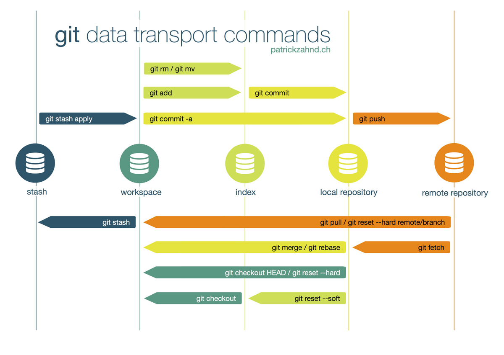

> En la carpeta vscode se encuentra información a cerca de Visual Studio Code, leer antes de empezar.

# Demo de VSCode
Se puede editar desde cualquier sistema que use Git, ya sea VSCode con Git integrado, otro editor con Git, desde la web vscode.dev o desde GitHub.

## Previo
1. Crear cuenta de GitHub [aquí](https://github.com/signup)
2. Instalar [VS Code](./vscode/vscode-install.md) en local para nuestro sisteam operativo. Más info [aquí](https://code.visualstudio.com/docs/setup/setup-overview)
3. Instalar [Git](https://git-scm.com/)
4. Nociones básicas de [vscode](./vscode/vscode-documentation.md):
- Explorador, búsqueda, control de código fuente (git), ejecución y depuración, extensiones (miles en tienda), etc.
- Paleta: Ctrl + shift + P | Buscador archivos (Ctrl + P)
- atajos teclado
- selectores múltiples
- terminal (desplazar de abajo o atajo teclado)
- emmet para web dev

1. Aprendiendo el control de versiones git, [chuleta con comandos de git](https://education.github.com/git-cheat-sheet-education.pdf)

- [93% de los desarrolladores usa Git según la encuesta de StackOverflow](https://survey.stackoverflow.co/2022/#technology-version-control)

> la URL puede usar el protocolo: HTTPS https://github.com/User/UserRepo o SSH git@github.com:User/UserRepo.git

6. Aprende GitHub con [GitHub Skills](https://skills.github.com/)

## Editar proyecto en local
1. Abrimos y editamos un proyecto de página web en local
2. Subimos los cambios con Git al repositorio remoto de GitHub
3. Publicamos la web en GitHub Pages
4. Descargamos los cambios en otro repositorio en local
